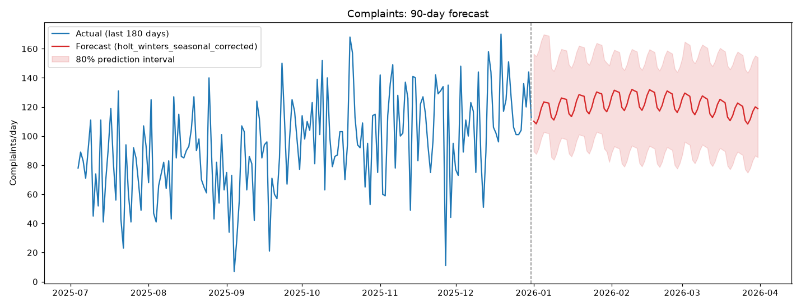

# Complaints Volume Forecasting

Forecasts daily incoming complaint volume for the 90 days following the end of the supplied dataset (**2026-01-01 to 2026-03-31**), to support capacity planning, triage resourcing, and prioritisation.

Overview: Rolling backtested 4 candidate models for predicting on a 90-day horizon. With only 3 years of data, a simpler model that generalised better is likely to be best. Backtesting finds that a Holt-Winters model without seasonality performed best, but a Holt-Winters with seasonality was selected for the final predictions to capture the impact of yearly seasonality. Complaints are expected to stay elevated (~108-128/day) peaking in February before a reduction in March, consistent with the seasonal pattern in every prior year. This also continues a year on year upward trend visible across the whole data. 

## How to run
```bash
pip install -r requirements.txt
python main.py            # full pipeline
```

## Project structure
```
complaints-forecast/
├── README.md 
├── requirements.txt
├── main.py                  
├── data/
│   └── Principle_Data_Scientist_Tech_Assessment.xlxs
├── src/
│   ├── data_loader.py           <- cleaning and imputation
│   ├── features.py              <- feature engineering
│   ├── models.py                <- forecasting models
│   ├── __init__.py
│   └── evaluate.py              <- rolling backtest
├── dev/
│   └── exploratory_data_analysis.ipynb   <-Juypter notebook of EDA
└── outputs/
    ├── plots/
    │   ├── eda_overview.png
    │   ├── backtest_comparison.png
    │   └── final_forecast.png
    └── forecasts/
        ├── forecast_90d.csv <- output of model for future 90 days
        ├── backtest_summary.csv 
        └── backtest_detail.csv 
```

## EDA findings

EDA is run in juypter notebook `exploratory_data_analysis.ipynb` 

1. **Data quality**: 43 whole days are missing from the calendar and afurther 10 rows have an explicit NaN `complaints` value (~5% of daysaffected). No duplicate dates. Gaps look scattered rather than systematic (no concentration on a particular weekday).

2. **Weekly seasonality**: Mon-Wed run ~85/day, Thu-Fri dip to ~72-74/day,
   weekends sit in between. Consistent enough to model directly.

3. **Annual seasonality**: a clear, *repeating* cycle in every one of the 3
   years - low in Jun-Aug (~54-67/day), high in Dec-Feb (~90-113/day).

4. **Year-on-year trend**: annual mean showed a positive trend from year to year (**67 (2023) →78 (2024) → 95 (2025)** )

5. **Bank holidays**: +5.7 complaints/day on average controlling for
   day-of-week, but not statistically significant (p=0.15) given only 24
   historical holidays

6. **Features** (`staffing_level_fte`, `backlog_days`,
   `media_mentions`, `channel_mix_index`): weakly to moderately correlated
   with complaints but staffing and backlog both increase alongside complaints. Most likely this is reactive rather than causal. These values are not known for the future.

## Data cleaning

Data is cleaned using function ins `src/data_loader.py`.

- Reindexed onto a continuous daily calendar (fills the 43 missing days as
  new rows).
- `is_weekend` / `bank_holiday_flag` that are missing are recreated from the data using the `holidays` Python package 
- `complaints` is linearly interpolated on the log1p scale (keeps it
  non-negative and count-like), rounded back to an integer.
- covariates (`staffing_level_fte`, `backlog_days`,
  `channel_mix_index`): linear interpolation.
- `media_mentions`: gaps filled with 0 as assuming  no
  strangemedia activity).

## Feature engineering

Feature engineering is in `src/features.py`. 

- **Calendar**: day-of-week, month, weekend/holiday flags, month-start/end,
  a linear trend index.
- **Fourier terms** (3 harmonics, 365.25-day period) for smooth annual
  seasonality, for the LightGBM model.
- **Lags**: 1, 2, 3, 7, 14, 21, 28, 35 days. Also include 364/371 days to find the same weekday last year. 
- **Trailing rolling mean/std** of the past 7/14/28 days

## Model choice & justification

I have tested 4 different models based on experience and success in simliar forecasting problems, as well as considering that there is a limitation on time for tuning and training.

| Model                              | What it captures                                                                                                                                  | What it misses                                                                           |
| ---------------------------------- | ------------------------------------------------------------------------------------------------------------------------------------------------- | ---------------------------------------------------------------------------------------- |
| Seasonal naive                     | Weekly pattern only (repeats last observed week)                                                                                                  | Trend, annual cycle                                                                      |
| Holt-Winters (weekly)              | Weekly pattern + damped trend                                                                                                                     | Annual cycle                                                                             |
| Holt-Winters + seasonal correction | Weekly pattern + damped trend + annual cycle                                                                                                      | Needs 2+ year of history to include reliable annual profile                              |
| LightGBM (Poisson, recursive)      | Will include all information as long as they are given as features (eg, weekly + annual (via Fourier) + trend (via YoY lags) + any non-linearity) | Needs lots of data to warrant its complexity. Multi step forecasting can compound errors |

There is a huge limitation with this model on the lack of daily data. We only have 2-3 annual cycles,

The rsluts of backtesting are in `outputs/forecasts/backtest_detail.csv` with overall results in `outputs/forecasts/backtest_summary.csv`. Below are a summary results of the testing. The mean absolute error (MAE) of the 90 day predictions and how that is broken down across the the 90 days.

| Model                              | MAE (overall) | MAE (1-7d) | MAE (8-30d) | MAE (31-90d) | RMSE (overall) | sMAPE (overall) |
| ---------------------------------- | ------------- | ---------- | ----------- | ------------ | -------------- | --------------- |
| **Holt-Winters**                   | **19.8**      | 24.0       | **19.0**    | **19.7**     | **25.3**       | **23.5**        |
| Holt-Winters + seasonal correction | 21.3          | **23.9**   | 19.6        | 21.6         | 26.9           | 24.9            |
| LightGBM (Poisson)                 | 23.8          | 26.4       | 23.2        | 23.7         | 29.5           | 28.2            |
| Seasonal naive                     | 24.8          | 25.8       | 23.7        | 25.2         | 31.5           | 29.2            |

Despite these results, I believe a judgement call has to be made to use the Holt-Winters model with seasonal correction.

Looking at the outputs, the Holt-Winters model with no seasonality continues an increase in complaints through March, when historically March has always hsowed a decrease. The inclusion of seasonality demonstrates a reduction in March as expected.

It is a much bigger operational risk to have key seasonility patterns ignored than to lose some overall MAE. 

Additonally, as the amount of data was increased the Holt-Winters with seasonal correction improved as more seasonal data was availble. With the final deliverable prdictions we should see improvements as it will have 3 years of seasonal patterns to train on.

## Final forecast

The final forecast is output to`outputs/forecasts/forecast_90d.csv` 


[]


This continues the year on year upward trend while also showing the recurring seasonal shape from historic data.


## Limitations & future work

Below are some of the limitations to this approach which could be addressed with more time to work on the problem or more data.

- Limited amount of data that only covered 2-3 years massively limits the reliablity for a model that is to predict these patterns. This forces the use of a simpler model. Going forward, as more data becomes availble this model would have to be actively reworked on.
- Complaint reason could be included in the data to improve predictions and make it more operationally usefull
- This model ignore bank holidays and other events due to limited data. As more data is collected and more examples of these special days become available they can be included in modelling.
- There are more time series predictions that can be tested with more time and more data
- Monitoring and retraining needs to be built into yearly work to ensure adaptions to any data drift or operational changes.
